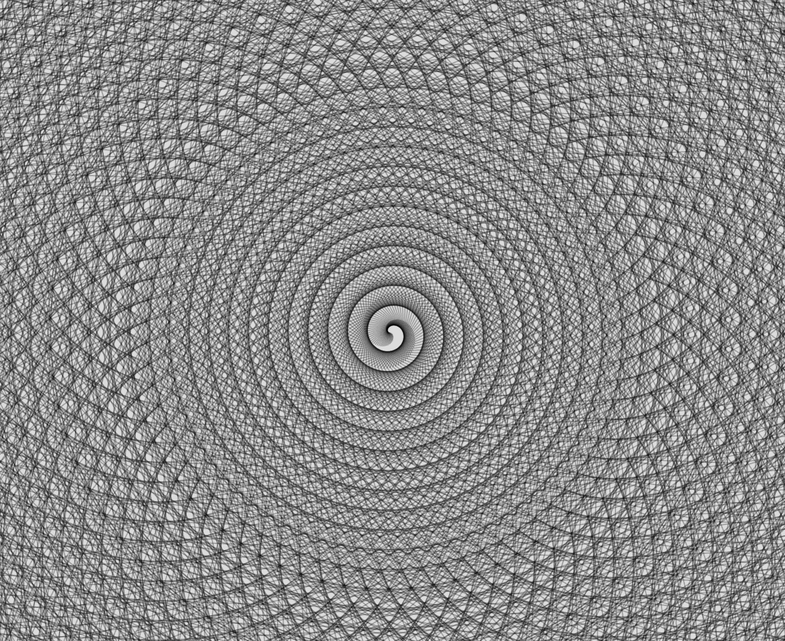

Hello, everyone!

Lately, I've been reading about [algorithmic botany](http://algorithmicbotany.org/). After that I was playing around with some code and created a cool animation that somewhat resembles flowers blooming. Check it out! 🌼

You can watch the real time animation by clicking on this <a href="https://editor.p5js.org/zoyron/full/wVmf79-uL" target="_blank">link</a>.



Algorithmic botany is a field within computational biology and computer graphics that focuses on using algorithms to model the growth and form of plants. 

## A simplistic overview of this project

In this project, the line grows and twists around the center of the screen, kinda like watching petals unfurl in real-time.
The trick is in the math and rotation. With each frame, the lines extend a bit more and rotate, creating these beautiful, floral designs.

This is the code that I used to make the pattern. 

```js
function setup() {
  createCanvas(windowWidth, windowHeight);
  background(220);
  angleMode(DEGREES);
}
let x = 0;
let angle = 45;
let rotation = 0.5;
function draw() {
  noFill();
  let r = 100;
  translate(width/2, height/2);
  rotate(rotation);
  stroke(0,70);
  line(-1-x,-0.5, 1+x,0.5+x);
  for(let i = 1;i<=5;i++){
  rotation+=1;
  }
  x+=0.5;
}
```
And if you want to play around with the code, copy paste the above code into <a href="https://editor.p5js.org/" target="_blank">this editor</a>, and hit the play button on the top left corner. Feel free to modofiy the code or run as is.
Try it out and watch these code-generated flowers bloom. It's a fun way to mix programming with the beauty of nature. 🌷

Happy coding and happy blooming! 🌸💻
