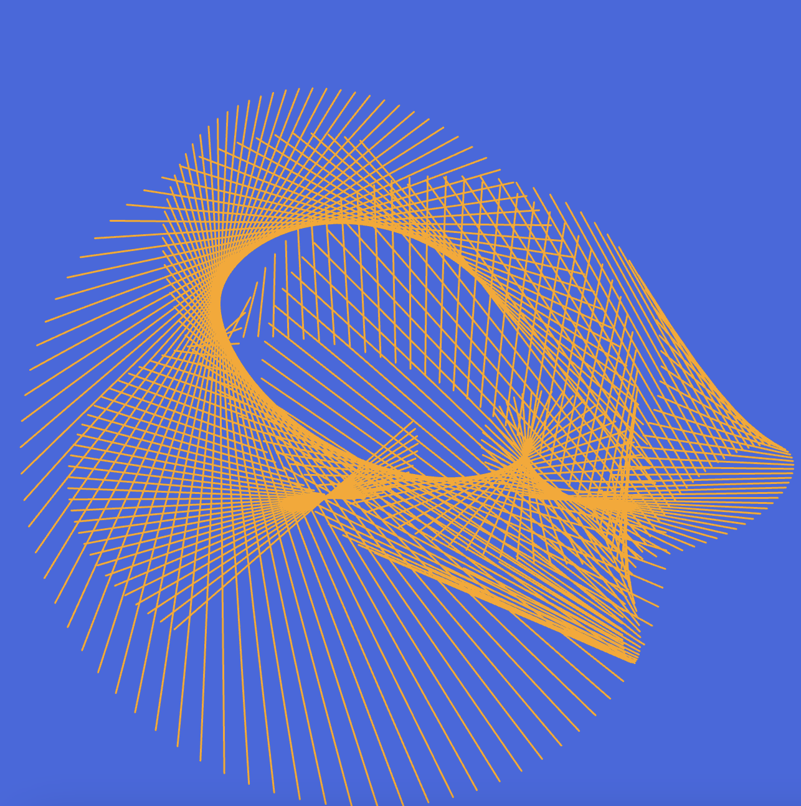

Hey everyone! 🌟

I've been experimenting with creating animations using parametric equations, and I'm excited to share my latest project with you. This animation combines math and art to create dynamic, evolving patterns.


To see the animation working in real-time, follow [this link](https://editor.p5js.org/zoyron/full/aJNwVd9n).
> This blog is aimed at beginners with limited knowledge of JavaScript.

---
## What's Happening?

The animation draws lines based on parametric equations, resulting in beautiful and fluid patterns. The lines grow and move, creating a mesmerizing visual effect. Let's break down the code and the math behind it.

### Where to write the code
Make sure you're writing code in <a href="https://editor.p5js.org/" target="_blank">this editor</a>. Since we're  working with the library p5js, setting it up locally could be a hassle for beginners. Hence, we're writing the code online.

### Setup and Initialization

First, we set up our canvas and initialize some variables:
```javascript
let t = 0;
let n = 1;
let dir = -1;

function setup(){
  createCanvas(windowWidth, windowHeight);
  frameRate(60);
}
```
- **Canvas Setup**: *createCanvas(windowWidth, windowHeight)* sets the canvas size to the full window.
- **Frame Rate**: *frameRate(60)* sets the animation to update 60 times per second for smooth visuals.

### Drawing the Animation

The draw function is where the magic happens. We use a combination of trigonometric functions to calculate the positions of the line endpoints, resulting in the beautiful patterns you see.
```javascript
function draw(){
  // Increment n until it reaches 250, then switch direction
  if(n < 250 && dir == -1){
    n++;
    if(n == 250)
      dir = 1;
  }

  // Set background color
  background('#2E3440');
  // Translate origin to center of canvas
  translate(width / 2, height / 2);
  // Set stroke color and weight
  stroke('#FFA500');
  strokeWeight(1.5);

  // Draw lines based on the current value of t and n
  for(let i = 0; i < n; i++){
    line(x1(t + i), y1(t + i), x2(t + i) + 50, y2(t + i) + 50);
  }
  // Increment t to animate
  t += 0.125;
}
```
- **Translate**: *translate(width / 2, height / 2)* moves the origin to the center of the canvas.
- **Loop**: The for loop runs n times per frame, drawing multiple lines.
- **Increment**: *t* is incremented to animate the lines over time.

### Parametric Equations

The positions of the line endpoints are calculated using parametric equations. These functions return the x and y coordinates based on the value of *t*.
> Note: The explanation of the functions is given in comments in details. So I won't be writing a separate section explaining these functions. 
```javascript
// Function to calculate x-coordinate of the first endpoint based on parameter t
function x1(t){
  // Calculate x-coordinate using a combination of sine functions with different frequencies
  return sin(t / 10) * 125 + sin(t / 20) * 125 - sin(t / 30) * 125;
}

// Function to calculate y-coordinate of the first endpoint based on parameter t
function y1(t){
  // Calculate y-coordinate using a combination of cosine functions with different frequencies
  return cos(t / 10) * 125 + cos(t / 20) * 125 - cos(t / 30) * 125;
}

// Function to calculate x-coordinate of the second endpoint based on parameter t
function x2(t){
  // Calculate x-coordinate using a combination of sine functions with different frequencies
  // and cosine function with a different frequency
  return sin(t / 15) * 125 + sin(t / 25) * 125 - cos(t / 35) * 125;
}

// Function to calculate y-coordinate of the second endpoint based on parameter t
function y2(t){
  // Calculate y-coordinate using a combination of cosine functions with different frequencies
  // and sine function with a different frequency
  return cos(t / 15) * 125 + cos(t / 25) * 125 - sin(t / 35) * 125;
}
```
---
## Complete Code  
If you're having difficulties collecting the bits of code from the blog, here's the entire code for the animation.

Just copy paste this code into <a href="https://editor.p5js.org/" target="_blank">this editor</a> and you're good to go.
```javascript
let t = 0;
let n = 1;
let dir = -1;
let strokeCol = 255;
let strokeChange = -1;

// Setup function to initialize the canvas and set the frame rate
function setup(){
  createCanvas(windowWidth, windowHeight);
  frameRate(60);
}

// Draw function to create the animation
function draw(){
  // Increment n until it reaches 250, then switch direction
  if(n < 250 && dir == -1){
    n++;
    if(n == 250)
      dir = 1;
  }
  
  // Set background color
  background('#2E3440');
  // Translate origin to center of canvas
  translate(width / 2, height / 2);
  // Set stroke color and weight
  stroke('#FFA500');
  strokeWeight(1.5);
  
  // Draw lines based on the current value of t and n
  for(let i = 0; i < n; i++){
    line(x1(t + i), y1(t + i), x2(t + i) + 50, y2(t + i) + 50);
  }
  // Increment t to animate
  t += 0.125;
}

// Function to calculate x-coordinate of the first endpoint based on parameter t
function x1(t){
  // Calculate x-coordinate using a combination of sine functions with different frequencies
  return sin(t / 10) * 125 + sin(t / 20) * 125 - sin(t / 30) * 125;
}

// Function to calculate y-coordinate of the first endpoint based on parameter t
function y1(t){
  // Calculate y-coordinate using a combination of cosine functions with different frequencies
  return cos(t / 10) * 125 + cos(t / 20) * 125 - cos(t / 30) * 125;
}

// Function to calculate x-coordinate of the second endpoint based on parameter t
function x2(t){
  // Calculate x-coordinate using a combination of sine functions with different frequencies
  // and cosine function with a different frequency
  return sin(t / 15) * 125 + sin(t / 25) * 125 - cos(t / 35) * 125;
}

// Function to calculate y-coordinate of the second endpoint based on parameter t
function y2(t){
  // Calculate y-coordinate using a combination of cosine functions with different frequencies
  // and sine function with a different frequency
  return cos(t / 15) * 125 + cos(t / 25) * 125 - sin(t / 35) * 125;
}
```
---
## Conslusion

By combining parametric equations and trigonometric functions, this code creates a dynamic, evolving pattern that is both visually stunning and mathematically interesting. It's a great example of how basic math can be used to create beautiful art. Happy coding! 🌟✨
