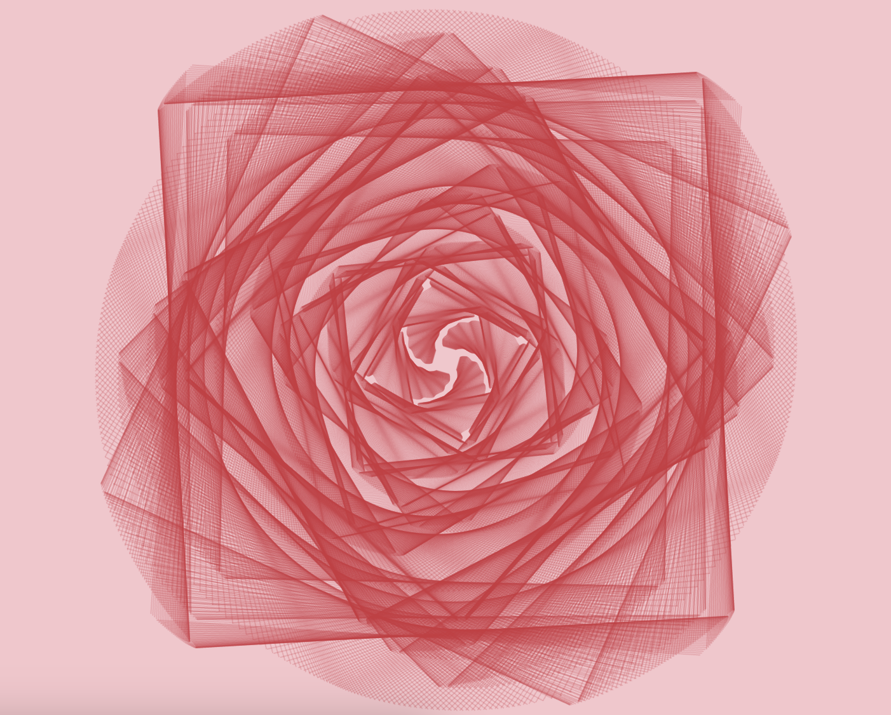

Hey everyone! 🌟

Today we're diving into a cool little sketch that creates some funky, ever-growing rotating lines.  



To see the animation working in real-time, follow [this link](https://editor.p5js.org/zoyron/full/GCeqPPGad)
>This blog is aimed at beginners with limited knowledge of JavaScript.

## Let's code

First off, we're using p5.js here, which is a super fun JavaScript library for creative coding. Instead of writing p5js code locally, I prefer their online editor which you can also use use <a href="https://editor.p5js.org/" target="_blank">here</a>. Make sure you're writing code in that editor only.

Let's start with the setup() function:
```javascript
function setup() {
  createCanvas(windowWidth, windowHeight);
  background("#f7c5cc");
}
```
This function runs once when you start the sketch. It's like setting the stage for our performance. We're creating a canvas that fills the whole window and painting the background a cute peachy color (#f7c5cc).

Now, let's look at these two lines outside of any function:
```javascript
let xoff = 0;
let len = 0;
```
These are our global variables. xoff will help us create some random movement, and len will control the size of our lines.

The real magic happens in the draw() function. This function runs over and over again, creating animation.
```javascript
function draw() {
  translate(width/2, height/2);
  stroke(204, 49, 61, 50);
  noFill();
```
We start by moving our drawing point to the center of the canvas (that's what translate() does). Then we set the color of our lines to a semi-transparent red and tell p5 we don't want to fill in any shapes.
We start by moving our drawing point to the center of the canvas (that's what translate() does). Then we set the color of our lines to a semi-transparent red and tell p5 we don't want to fill in any shapes.

Now for the cool part:
```javascript
rotate(radians(noise(xoff)*360));
```
This line rotates our entire drawing. We're using p5's noise() function, which gives us smooth random numbers, to create a rotation angle. As xoff changes, our rotation will change smoothly.

Next, we draw our lines:
```javascript
line(-10-len/2,-5-len/2,-10-len/2,5+len/2);
line(10+len/2,-5-len/2,10+len/2,5+len/2);
line(-5-len/2,10+len/2,5+len/2,10+len/2);
line(-5-len/2,-10-len/2,5+len/2,-10-len/2);
```
Each line() function draws a straight line. We're drawing four lines here, positioned to form a kind of square shape. The len variable is used in all these calculations, which means our shape will grow over time.

Finally, we update our variables:
```javascript
xoff+=0.005; 
len=len+0.275;
```
We increase xoff by a tiny amount each frame, which will slowly change our rotation. We also increase len, which makes our lines grow longer over time.

---

## Complete Code

If you’re having difficulties collecting the bits of code from the blog, here’s the entire code for the animation.

Just copy paste the following code into <a href="https://editor.p5js.org/" target="_blank">this editor</a> and you’re good to go.
```javascript
function setup() {
  createCanvas(windowWidth, windowHeight);
  background("#f7c5cc");
}
let xoff = 0;
let len = 0;
function draw() {
  translate(width/2, height/2);
  stroke(204, 49, 61,50);
  noFill();
  rotate(radians(noise(xoff)*360));
  line(-10-len/2,-5-len/2,-10-len/2,5+len/2);
  line(10+len/2,-5-len/2,10+len/2,5+len/2);
  line(-5-len/2,10+len/2,5+len/2,10+len/2);
  line(-5-len/2,-10-len/2,5+len/2,-10-len/2);
  xoff+=0.005; 
  len=len+0.275;
  
}
```
And that's it! When you run this code, you'll see a trippy, growing pattern of red lines that seems to rotate randomly. Pretty cool, huh?

Remember, the key to understanding code is to experiment.Try changing some numbers and see what happens. What if you change the color? Or make the lines grow faster? The possibilities are endless!

Happy coding, and don't forget to have fun! 🚀


