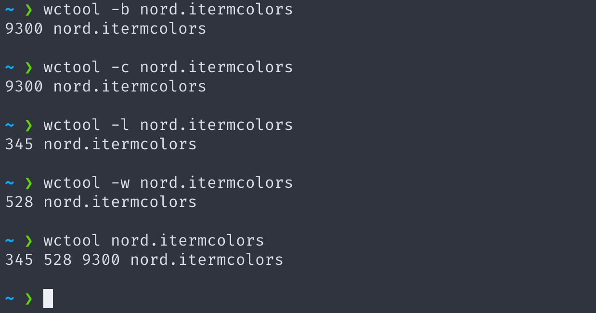

Hey everyone! Today, I'll create a simple command-line tool in Node.js that mimics the functionality of the Unix wc (word count) command. This tool will allow us to count the number of bytes, lines, words, and characters in a text file. We'll walk through the code step-by-step, assuming you have a basic understanding of JavaScript.

First, let's create the project structure. Open your terminal and run the following commands:
```sh
mkdir wctool
cd wctool
mkdir bin
touch bin/index.js
npm init -y
```

This is what your file structure should look like at this point:
```go
wctool/
├── bin/
│   └── index.js
└── package.json
```

Before we get to code, let's understand how we'd be running the tool on the command line.

#### Usage
One way to run the tool is:
```bash
wctool [option] filePath
```

The **option** input is *optional*. <sub>(you see, what I did there xD)</sub>
You can also run the tool the following way as well:
```bash
wctool filePath
```

### Let's start coding
Like the title says, let's dive into the code by importing the required modules and handling the command line arguments(text that you'd enter while running this tool).
#### Handling the command-line arguments
```javascript
/*
* importing the required module.
* Yes, we need to import this one module only for this project.
*/
const fs = require('fs');

/*handling the input command-line arguments*/
let args = process.argv[2];
let fileName = process.argv[3];

/*if no options is entered, the 2nd index is then treated as the file name*/
if (!fileName) {
  fileName = args;
  args = null;
}
```
As we noticed that there are 2 ways to run this tool - one with options, and the other, without options. So we need to tackle both the scenarios. whether the file name or the option entered is correct or not, that gets checked later on. 

#### Checking if the file exists and executing the desired option.

Before performing any operations, we need to check if the specified file exists.
We use a switch statement to handle different command-line options. If no option is provided, we run the default output.
```javascript
/*
* if the 'fileName' exists,
* then we enter into our switch statement
*/
if (fs.existsSync(fileName)) {
    ......
} 

/*
* if the 'fileName' doesn't exist then we print this line, 
* and the user is now supposed to run the command again with proper input
*/
else {
  console.log('Enter a valid file name that exists');
}
```

Now let's dive deep into our **switch** statement. There are some *functions* being called in the switch statement, we'll get to their implementation in a short while only. Let's first explore each option that can be entered in the command line: 

```javascript
/*The file exists, so we now dive into the switch statement*/
if (fs.existsSync(fileName)) {
  switch (args) {
    /*
    * the "byteCount()" function is invoked
    * if the options entered by the user is "-b"
    */
    case '-b':
      console.log(`${byteCount()} ${fileName}`);
      break;

    /*
    * the "lineCount()" function is invoked
    * if the options entered by the user is "-l"
    */
    case '-l':
      console.log(`${lineCount()} ${fileName}`);
      break;

    /*
    * the "wordCount()" function is invoked
    * if the options entered by the user is "-w"
    */
    case '-w':
      console.log(`${wordCount()} ${fileName}`);
      break;

    /*
    * the "charCount()" function is invoked
    * if the options entered by the user is "-c"
    */
    case '-c':
      console.log(`${charCount()} ${fileName}`);
      break;

    /*
    * If no option is entered by the user, but the fileName exists, then we run the default option
    * The default is invoking the "lineCount()", "wordCount()", and the "byteCount()" functions.
    */
    case null:
      console.log(`${lineCount()} ${wordCount()} ${byteCount()} ${fileName}`);
      break;

    /*
    * And in the scenario where the fileName exists,
    * but the option entered by the user is wrong,
    * then we print the correct available options to the user.
    */
    default:
      console.log(`Invalid option.\nThe following options are supported
        -w\tprints the number of words in the file
        -l\tprints the number of lines in the file
        -b\tprints the number of bytes in the file
        -c\tprints the number of characters in the file`);
  }
} 

/*The file doesn't exist at the path we entered*/
else {
  console.log('Enter a valid file name that exists');
}
```
___
## Implementing the functions

Let's start with the best part of this project, finally, we implement the functions to count bytes, lines, words, and characters in the file:

#### Byte Count
```javascript
/*
* This function returns the number of bytes in the file:
*/
function byteCount() {
  try {
    let buffer = fs.readFileSync(fileName); // open file as binary sequence
    return buffer.length;
  } catch (e) {
    console.log(e.message);
  }
}
```

#### Line Count
```javascript
/*
* This function returns the number of lines in the file:
*/
function lineCount() {
  try {
    let data = fs.readFileSync(fileName, 'utf-8');
    return data.split(/\r\n|\r|\n/).length;
  } catch (e) {
    console.log(e.message);
  }
}

```

#### Word Count
```javascript
/*
* This function returns the number of word in the file:
*/
function wordCount() {
  try {
    let data = fs.readFileSync(fileName, 'utf-8');
    return data.split(/\s+/g).filter(Boolean).length;
  } catch (e) {
    console.log(e.message);
  }
}

```

#### Character Count
```javascript
/*
* This function returns the number of characters in the file:
*/
function charCount() {
  try {
    let data = fs.readFileSync(fileName, 'utf-8');
    return data.length;
  } catch (e) {
    console.log(e.message);
  }
}

```

## Entire code

The code we discussed above is the complete, and is capable of running if you put it all in the index.js file in the bin directory that we created at the beginning. But if you're having trouble navigating through the post to collect the code bits, visit **[this link](https://github.com/zoyron/wcTool/blob/master/bin/index.js)** to get the code in one single file.

---

## Running the tool locally and usage

Installation and running the tool locally:
The following steps would ensure that you are able to install and run this tool locally
```bash
git clone https://github.com/zoyron/wcTool.git
cd wcTool
npm install -g .
```
#### Usage
Now that you have installed the tool, let's see how you can use it.

- To count bytes
```sh
wctool -b pathTofile
```

- To count characters
```sh
wctool -c pathTofile
```

- To count lines
```sh
wctool -l pathTofile
```

- To count words
```sh
wctool -w pathTofile
```


## Conclusion

In this blog post, we've walked through creating a simple command-line tool in Node.js to count bytes, lines, words, and characters in a text file. This project demonstrates how to handle command-line arguments, read files, and perform basic string operations in Node.js. This project is completely open-source, so feel free to extend and improve this tool to suit your needs!
